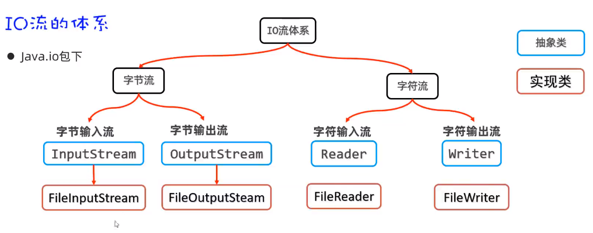
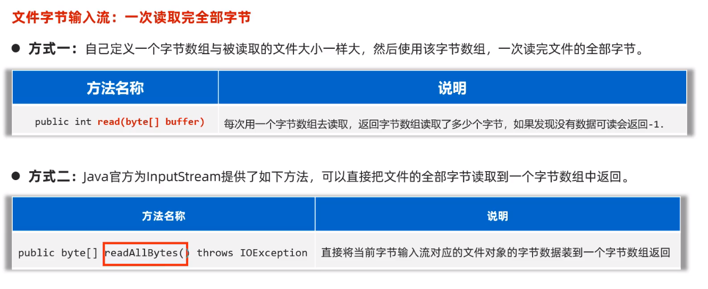
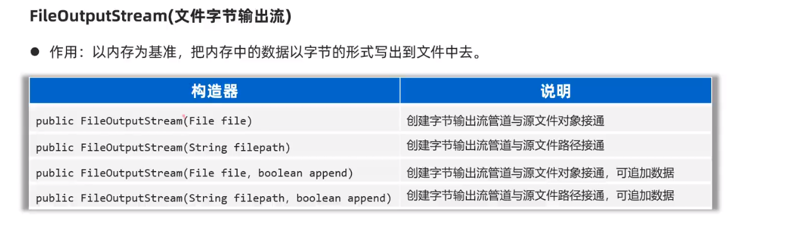
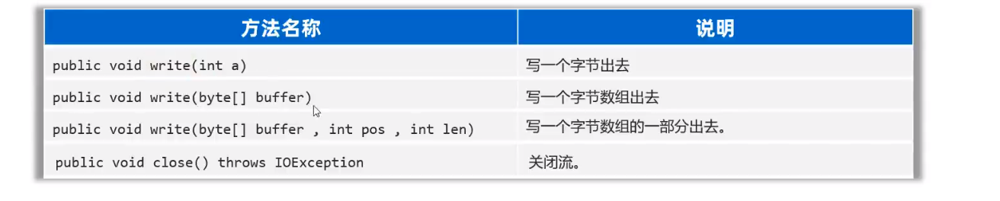

### IO

负责把数据读取到内存中去,或者是把网络中的数据读到程序中去.

#### 输入流

input:指的是把数据读到内存中去
output:指的是将内存中的数据写到内存中去

数据存储/文件复制/网络通信等都使用到了IO流

#### IO的体系和分类

按照流的方向分:输入流/输出流

按照流数据中最小单位去分:字节流/字符流

- 字节流:常常用来传输音频/视频/图片/文本文件的复制/转移等.
- 字符流:只适合操作纯文本文件,比如读写txt文件和Java文件




##### 字节输入流(InputStream--抽象类)

FileInputStream 文件字节输入流

* FileInputStream(File file)-->通过File对象获取文件字节流
* FileInputStream(String name)-->通过文件路径获取文件字节输入流

提供read()方法

* read()-->从何文件中读取一个字节的数据
* read(byte[] b)-->从文件中读取最多b个字节的数据

在读取文件的时候常用read(byte[] b)的方式去读取

```java
        //创建一个字节流代表对象与源文件接通
        InputStream input = new FileInputStream(new File("src/io_learn/assets/data02.txt"));
//        //开始读取一个文件中的字节数据
        byte[] buff = new byte[3];
//        int len = input.read(buff);
//        String s = new String(buff);
//        System.out.println(s);
//        System.out.println("单次读取的字节数量:"+len);
//        //千万要注意读取多少就倒处多少
//        int len2 = input.read(buff);
//        String s2 = new String(buff,0,len2);
//        System.out.println(s2);
//        System.out.println("单次读取的字节数量:"+len2);
        int b ;
        while ((b = input.read(buff))!=-1){
            String res = new String(buff,0,b);
            System.out.print(res);
        }
        input.close();
```

readAllBytes()用法
~~~java
//一次性读取全部字节到数组中
        InputStream input = new FileInputStream("src/io_learn/assets/data03.txt");
//        //准备一个字节数组,和文件大小一样大
//        File f =new File("src/io_learn/assets/data03.txt");
//        long length = f.length();
//        byte[] buffer = new byte[(int) length];
//        int read = input.read(buffer);
//        String s = new String(buffer);
//        System.out.println(s);
//        System.out.println(read);
//        input.close();
        byte[] bytes = input.readAllBytes();
        System.out.println(new String(bytes));
        input.close();
~~~
这时就会有一个问题

- 如果直接把文件全部读取到一个字节数组,可以避免乱码其实是存在问题的,如果文件太大是可能引起内存溢出的.

这个时候我们可以使用字符流专门去做关于文本输入输出的操作

##### 字节输出流(OutputStream--抽象类)

文件字节输出流,是写字节数据到文件中去:1.接通文件 2.写入数据


在这里直提供了一个文件复制粘贴的练习去理解outputStream
~~~java
        //创建一个字节管道与文件接通
        String filePath = "src/io_learn/assets/dt";
        File file = new File(filePath);
        if (!file.isDirectory()){
            file.mkdir();
            new File(filePath+"/data.txt").createNewFile();
        }else {
            new File(filePath+"/data.txt").createNewFile();
        }
        
        OutputStream output = new FileOutputStream(filePath+"/data.txt");
        InputStream input = new FileInputStream("src/io_learn/assets/data.txt");
        byte[] bytes = input.readAllBytes();
        output.write(bytes);
        output.write(bytes1,0,6);//表示从第0个字节写到第6个字节（不包括第六个字节），来实现将你好写入data.txt中
        output.close();
        input.close();
~~~
使用FileOutputStream在已有文件中追加数据
```java
//追加数据
OutputStream fileOutputStream = new FileOutputStream(filePath,true);
fileOutputStream.write("\n你好啊".getBytes());
//也可以直接输入换行符让其write完每一行之后去换行
fileOutputStream.write("\r\n".getBytes());
fileOutputStream.close();
```
###### 文件拷贝案例
在assets/img资源文件中有一个 avatar.jpg的文件,现在有一个需求就是需要把这个文件拷贝到dt/img中
,我们知道,dt/下是没有img文件夹的,所以刚开始我们判断一下是否有这个文件夹,如果有,我们就直接创建文件,
然后执行拷贝,如果没有,就自动建一个文件夹
```java
public static void main(String[] args) throws Exception{
        //先确认这个文件夹是否存在
        String path = "src/io_learn/assets/dt/img";
        File dir = new File(path);
        if (!dir.isDirectory()){
            dir.mkdirs();
        }
        //确定文件夹下是否有这个文件
        String newFilePath = "src/io_learn/assets/dt/img/avatar.jpg";
        File file = new File(newFilePath);
        if (Objects.isNull(file) || file.exists()){
            //如果没有,就创建这个文件
            file.createNewFile();
        }
        //原文件地址
        String loadlFilePath = "src/io_learn/assets/img/avatar.jpg";
        //读取原文件
        InputStream input = new FileInputStream(loadlFilePath);
        //读取到的文件字节数组
        byte[] bytes = input.readAllBytes();
        input.close();
        //将读取到的字节数组写到新的位置
        OutputStream output = new FileOutputStream(newFilePath);
        output.write(bytes);
        output.close();
    }
```
现在有一个需求,需要将src/io_learn/assets/sound.mp3拷贝到src/io_learn/assets/dt/audio/sound.mp3中，并显示拷贝的进度
```java
public static void main(String[] args) throws Exception {
        //确保写入流的路径是否通畅，这个地方为了确保文件夹存在
        // 目标文件夹位置
        String newFileDir = "src/io_learn/assets/dt/audio";
        File dir = new File(newFileDir);
        //判断一下是否存在这个文件夹
        if (!dir.isDirectory()){
            dir.mkdirs();
        }
        String newFilePath = newFileDir+"/sound.mp3";
        File file = new File(newFilePath);
        //判断目录下是否有和这个文件,如果没有那么就新建一个
        if (Objects.isNull(file) || file.exists()){
            file.createNewFile();
        }

        //到了这里就是目标文件夹存在且目标文件对象存在的情况
        //拿到源文件的输入流
        String localPath = "src/io_learn/assets/sound.mp3";
        long fileSize = new File(localPath).length();//获取文件的总大小,方便计算百分比
        InputStream input = new FileInputStream(localPath);
        OutputStream output = new FileOutputStream(newFilePath);
        int len;
        long size =0;
        
        byte[] buffer = new byte[10];//规定每次读取10byte的数据(总大小11.4Mb)
        while((len = input.read(buffer))!=-1){
            size+=len;
            output.write(buffer,0,len);
            System.out.println("当前进度:"+getPercent2(size,fileSize));
        }
        input.close();
        output.close();
    }
    public static String getPercent2(long x, long y) {
        double d1 = x * 1.0;
        double d2 = y * 1.0;
        // 设置保留几位小数， “.”后面几个零就保留几位小数，这里设置保留两位小数
        DecimalFormat decimalFormat = new DecimalFormat("##.00%");
        return decimalFormat.format(d1 / d2);
    }
```
##### 字符输入流(Reader--抽象类)

##### 字符输出流(Writer--抽象类)
